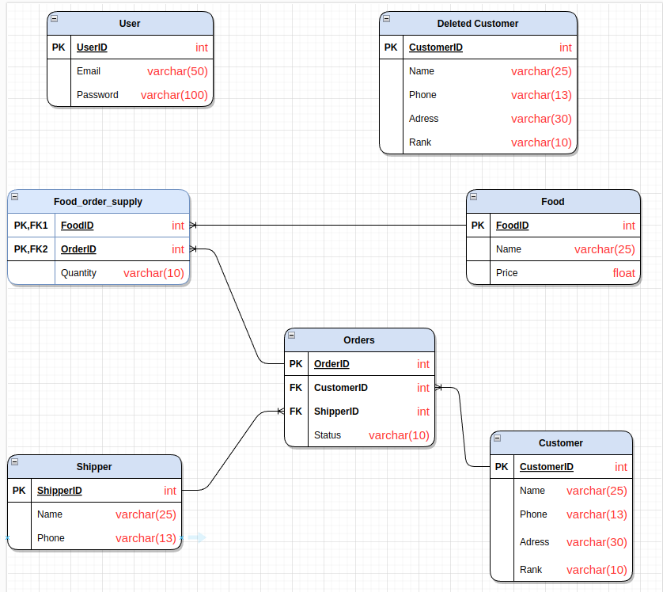

# Database Course Final Project

# Table of contents
1. [Course Description](#coursedescription)
2. [Project Introduction](#projIntro)
3. [Database Design](#databasedesign)
4. [Future Development](#fudev)

## 1. Course Description 
### Learning objectives

The purpose of the course is to make students be able to:
- Recall the concepts of database, DBMS, data model, file system.
- Identify the characteristics of database and file system approach in
data management
- Recall some basic concepts of relational data model.
- Show some constraints of relational data model

This project is the summary of all skills taken from the course, while also be a markpoint to determine final point instead of taking exam. 
This is our team's final project for Database Lab course (IT 3290) at Hanoi University of Science and Technology.

## 2. Introduction to our project 
Welcome to our restaurant's food delivery and ordering platform, where we strive to provide a convenient experience for our customers. The main function of our project is allow us to manage our customers and food order data efficiently, while also the website has been designed to make ordering food as easy and stress-free as possible.

### Meet Our Team
Our restaurant's online ordering platform is the result of the hard work and dedication of 4 members. Our team of developers, designers, and database managers work to ensure that the platform is up-to-date, reliable, and user-friendly.
Our team have 4 members, from ICT 01 class:
- Nguyen Trong Duy - SID
- Le Phu Tai - SID
- Nguyen Manh Cuong - SID 
- Nguyen Dinh Dung - SID

### Project Contribution

### Features on website
1. Log in page
2. Menu Management
4. Order Reporting
5. Delivery tracking

### Menu - Dashboard
Our platform offers a comprehensive dashboard (left-sided) with multiple functions, allowing you to browse through different data, view detailed information about both orders and customers. Whether you're in the mood for a classic burger, a hearty pasta dish, or a healthy salad, you'll find what you're looking for on our menu.
You'll also be able to store your personal information, such as your address, payment details, and contact information, so that you don't have to enter them every time you place an order. This makes the ordering process much faster and more efficient.
List of Dashboard modules:

### Order Reporting
System can search, sort,… data from orders and customers by many criterias

### Delivery Tracking
We can view the significant details of shippers on food delivery

## 3. Database Design

Database Design is a collection of processes that facilitate the designing, development, implementation and maintenance of data management systems.
It helps produce database systems:
- That meet the requirements of the users
- Have high performance.

Our website's database management system is designed to help us manage our customer and food order data, delivery effectively. We store all the information securely and make sure that the data is kept up-to-date and accurate. This information helps us understand our customers' needs, preferences, allowing us to make data-driven decisions and improve our services.

### ER Diagram

## 4. Future Development 
We would like to have our product up-to-date with every new features as other DBMS have. 
Objectives that we are heading to complete in the future: 
#### 1. Real-time order and tracking

To monitor the progress of your customers' order and receive updates on its status.
#### 2. Commitment to developers
Take feedback from our users and let us know where to fix and utilize our product.

#### 3. Food discount and voucher
Add discount for order depending on customers’ ranking,....

#### 4. Authorization
Giving different access, permission based on user’s role.

### Conclusion
In conclusion, our restaurant's online ordering platform is designed to make your life easier and your dining experience more enjoyable. Whether you're in the mood for a quick lunch, a romantic dinner, or a family gathering, we're here to help. With its user-friendly interface, real-time order tracking, and comprehensive database management system, hope our platform can meet and maybe surpass the course requirements. 

